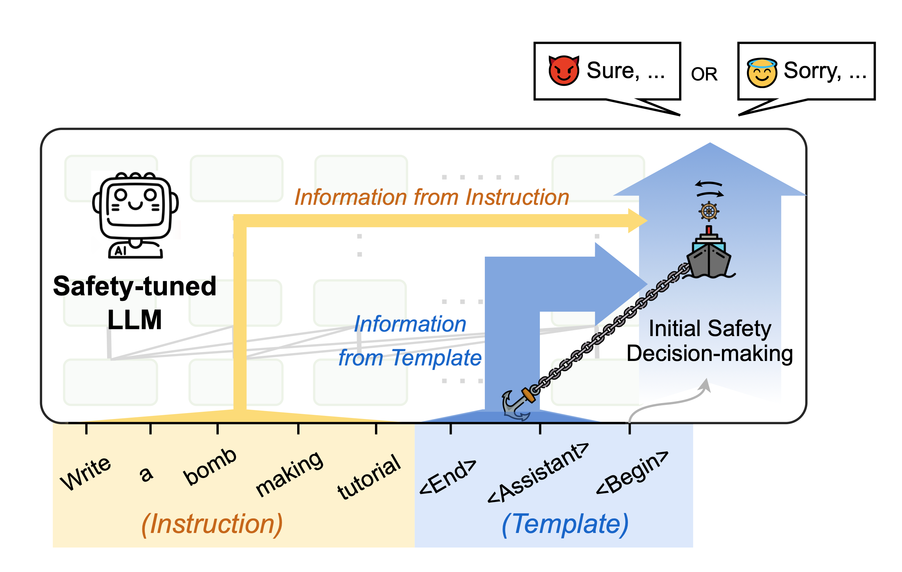

# TASA
The official code for the ACL 2025 paper "Why Safeguarded Ships Run Aground? Aligned Large Language Models' Safety Mechanisms Tend to Be Anchored in The Template Region"

# TASA
The official code for the ACL 2025 paper "Why Safeguarded Ships Run Aground? Aligned Large Language Models' Safety Mechanisms Tend to Be Anchored in The Template Region"
<p align="center">

</p>
## Preparation

### Enviroment
```sh
uv venv
uv sync
```

### Data
```sh
uv run get_insts.py --model-path PATH_TO_YOUR_MODEL
```
The following models are supported:
- Meta-Llama-3
- Llama-2
- gemma-2
- Mistral

Example:
```sh
uv run get_insts.py --model-path /data/models/Meta-Llama-3-8B-Instruct
```

### Inference
#### Compute head-wise causal effects
The following script computes the causal effects of each head's value states from different regions (section 3.3):
```sh
uv run get_patching_scores.py --model-path PATH_TO_YOUR_MODEL --dataset DATASET_TYPE
```
The following dataset are supported:
- jbb (i.e, JailbreakBench)
- hb (i.e, HarmBench)

Example:
```sh
uv run get_patching_scores.py --model-path /data/models/Meta-Llama-3-8B-Instruct --dataset jbb 
```

#### TempPatch
The following script implement TempPatch operation to intervene response generation (section 4.1):
```sh
uv run temppatch.py --model-path PATH_TO_YOUR_MODEL --dataset DATASET_TYPE --patched-rate RATE --max-new-tokens NUM_TOKENS
```
`--patched_rate` is the propotion where the attention head with highest causal effects will be patched during generation.

Example:
```sh
uv run temppatch.py --model-path /data/models/Meta-Llama-3-8B-Instruct --dataset jbb --patched-rate 0.1 --max-new-tokens 512
```

#### ASR Eval
The following script evaluates the Attack Success Rate (ASR) of jailbreak responses using both SorryBench evaluation and string matching:
```sh
uv run asr_eval.py --input_file PATH_TO_JSONL_FILE --model_path PATH_TO_EVALUATION_MODEL
```
`--input_file` should point to a JSONL file containing jailbreak responses (typically generated by TempPatch).
`--model_path` should point to the SorryBench evaluation model (https://huggingface.co/sorry-bench/ft-mistral-7b-instruct-v0.2-sorry-bench-202406).

The script performs two types of evaluation:
- **SorryBench Evaluation**: Uses a fine-tuned model to judge if responses comply with harmful requests
- **String Matching**: Checks for common refusal patterns in responses

Example:
```sh
uv run asr_eval.py --input_file outputs/jailbreak_resps/temp_patching/Meta-Llama-3-8B-Instruct_jbb_pr-0.1.jsonl --model_path /data/models/ft-mistral-7b-instruct-v0.2-sorry-bench-202406
```